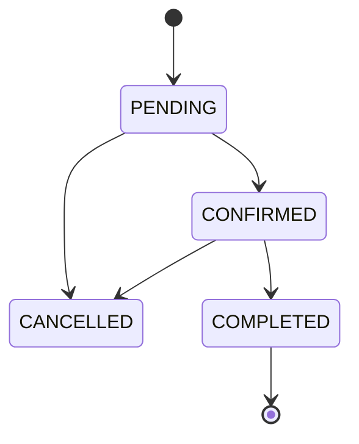

# {{EMOJI}} {{PROJECT_NAME}} — ERD 문서 v1.0

> **문서 버전:** v1.0
> **작성일:** YYYY-MM-DD
> **연관 문서:** 프로젝트 계획서 v1.0 / API 명세서 v1.0

---

## 목차
1. ERD 전체 다이어그램
2. 테이블 정의서
3. 관계 정의
4. 상태 코드 정의
5. 변경 내역
6. 설계 결정 사항 & 주의사항

---

## 1. ERD 전체 다이어그램

```mermaid
erDiagram
    {{ENTITY_1}} ||--o{ {{ENTITY_2}} : "1:N 관계명"
    {{ENTITY_1}} {
        BIGINT id PK
        VARCHAR name
        DATETIME created_at
    }
    {{ENTITY_2}} {
        BIGINT id PK
        BIGINT {{ENTITY_1_id}} FK
        VARCHAR status
    }
```

---

## 2. 테이블 정의서

### 2.1 {{ENTITY_1}} — {{한글 설명}}

| 컬럼 | 타입 | NULL | 기본값 | PK/FK/UK | 설명 |
| --- | --- | --- | --- | --- | --- |
| id | BIGINT | N | AUTO_INCREMENT | PK | |
| name | VARCHAR(100) | N | — | | |
| status | VARCHAR(20) | N | 'ACTIVE' | | 상태코드: 섹션 4 참조 |
| created_at | DATETIME | N | CURRENT_TIMESTAMP | | |
| updated_at | DATETIME | Y | NULL | | |

**인덱스**
- `idx_{entity}_status` ON (status)
- `uk_{entity}_name` UNIQUE ON (name)

---

### 2.2 {{ENTITY_2}} — ...

| 컬럼 | 타입 | NULL | 기본값 | PK/FK/UK | 설명 |
| --- | --- | --- | --- | --- | --- |
| id | BIGINT | N | AUTO_INCREMENT | PK | |
| ... | ... | ... | ... | ... | ... |

---

<!-- 필요한 만큼 복제 -->

---

## 3. 관계 정의

### 3.1 관계 목록

| 부모 | 자식 | 카디널리티 | 의미 |
| --- | --- | --- | --- |
| {{ENTITY_1}} | {{ENTITY_2}} | 1:N | ... |

### 3.2 외래 키(FK) 목록

| 자식 테이블 | FK 컬럼 | 참조 테이블 | 참조 컬럼 | ON DELETE | ON UPDATE |
| --- | --- | --- | --- | --- | --- |
| {{ENTITY_2}} | {{ENTITY_1}}_id | {{ENTITY_1}} | id | RESTRICT | CASCADE |

---

## 4. 상태 코드 정의

### 4.1 {{ENTITY}}.status 상태 흐름



### 4.2 상태별 상세 정의

| 상태 | 설명 | 다음 상태 | 전이 트리거 | 전이 권한 |
| --- | --- | --- | --- | --- |
| PENDING | 생성 직후 | CONFIRMED, CANCELLED | ... | {{ROLE}} |
| CONFIRMED | 확정 | COMPLETED, CANCELLED | ... | {{ROLE}} |
| COMPLETED | 완료 | - | - | - |
| CANCELLED | 취소 | - | - | - |

### 4.3 Role 코드

| 코드 | 설명 | 주요 권한 |
| --- | --- | --- |
| ROLE_ADMIN | 관리자 | 전체 CRUD |
| ROLE_{{X}} | ... | ... |

---

## 5. v0 → v1.0 변경 내역

- 초기 작성

---

## 6. 설계 결정 사항 & 주의사항

### 6.1 핵심 설계 결정
1. **{{결정 1}}** — 근거: ...
2. **{{결정 2}}** — 근거: ...

### 6.2 MVP 범위에서 의도적으로 제외한 설계 요소
- {{제외 1}} — 이유
- {{제외 2}} — 이유

### 6.3 인덱스 권장사항
- 조회 빈도 높은 컬럼: ...
- 복합 인덱스: ...

### 6.4 JPA 엔티티 패키지 구조 (권장)

```
com.example.{{project}}.domain
├── {{entity1}}/
│   ├── {{Entity1}}.java
│   └── {{Entity1}}Repository.java
└── {{entity2}}/
    ├── {{Entity2}}.java
    └── {{Entity2}}Repository.java
```

---

## 📋 전체 테이블 요약

| # | 테이블 | 설명 | 주요 FK |
| --- | --- | --- | --- |
| 1 | {{ENTITY_1}} | ... | - |
| 2 | {{ENTITY_2}} | ... | {{ENTITY_1}}_id |
